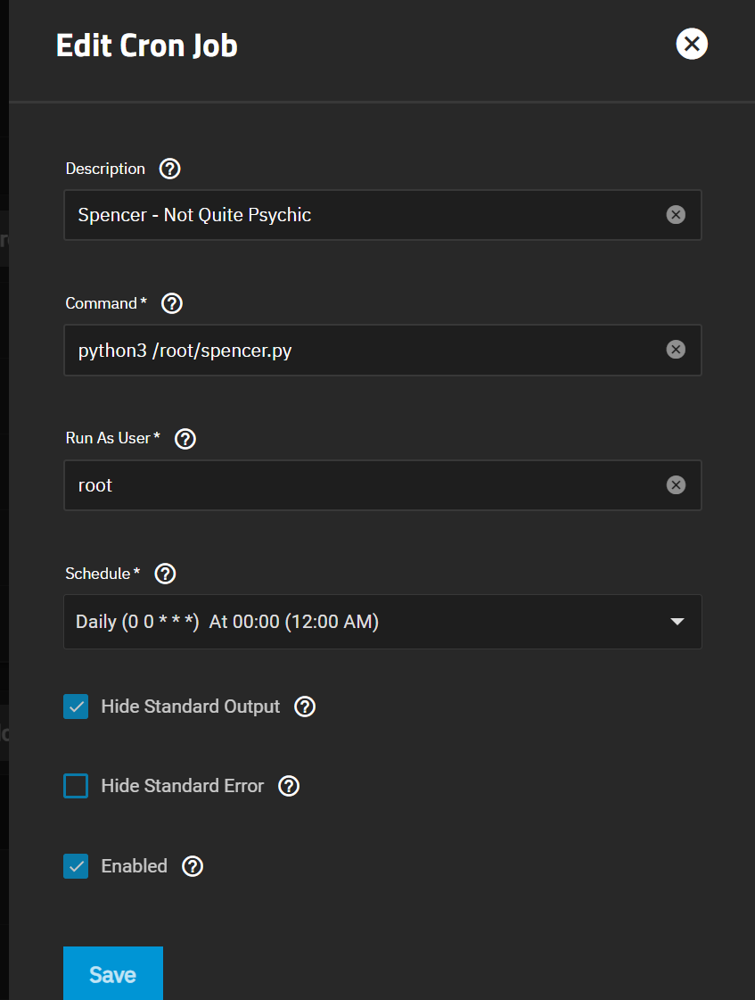

Cross Posted from Here, Source Available for Distibution: [Spencer V2.0-BETA 1- Now with Pineapple - An Email Alert Script for Potentially Hidden Problems | TrueNAS Community](https://www.truenas.com/community/resources/spencer-v2-0-beta-1-now-with-pineapple-an-email-alert-script-for-potentially-hidden-problems.226/)

.jpg)

```
**Spencer v2.0 BETA-1**

**Not Quite Psychic...**

# Version 2.0 08/22/23

# Refactored alot of code.

# Dynamically determine whether run from MultiReport or if Spencer is called directly.

# Overall improvements to robustness of the script, the accuracy of it's findings, and an increase in scope.

# New search patterns and customizability.

# -----------------------------------------------

# Verion 1.3 08/13/23 - Contibution by JoeSchmuck merged

# Added a new feature for tracking and reporting previous errors differantly than new errors.

# -----------------------------------------------
```

🍍 **A special thanks to [**@joeschmuck**](https://www.truenas.com/community/members/joeschmuck.101/) for his recent and welcome contributions!!** 🍍

**_______________________________________________________________________________________________________________**

**TL;DR**

**This script was written to identify issues which may otherwise be silent, as they are not reported by the built-in TrueNAS Alert system nor in some 3rd party community scripts like [@joeschmuck](https://www.truenas.com/community/members/joeschmuck.101/)'s Multi-Report.**

https://www.truenas.com/community/resources/multi_report-sh-version-for-core-and-scale.179/updates

**This script works with both CORE and SCALE.**

**Due to a change in logging on SCALE Cobia, this script will not work on versions newer than 22.12.x!**

**I will update it when I am able.**

__________________________________________________________________________________________________________________

🍍 **"Spencer Reports"** 🍍

**[I Know, You Know](https://psychusa.fandom.com/wiki/I_Know,_You_Know)**

Okay, Gus, listen up! This isn't your grandmother's script, it's the "Spencer" script! You know, named after me, **the** Shawn Spencer. It's got that psychic detective edge.

You see, first, it's got this fancy thing where it talks to the spirits – or a JSON file, but who's keeping track – and figures out what errors it's seen before. I like to think of it as the script's own little psychic vision.

Then, it gets down to business, checking out the current scene (or, you know, the logs) and finding any new mysterious events that occurred. If there's something fishy, like there's no new errors but old ones are lurking around, it's going to shout out loud with our **"PREVIOUS ERROR"** alert. If everything's hunky-dory, then it celebrates with a joyful **"SUCCESS"** note. And if there are any new secrets unveiled, it'll don the **"ERROR"** hat.

Now, what's cooler is this script doesn't just stop at identifying these errors. Oh no! It dresses them up real nice and presents them like I present clues. And of course, it won't leave you hanging. It provides all the juicy details about each error, including a super intense description and how many times that sneaky error appeared.

Oh, and just in case you're super curious, it will also tell you the exact time and place (or you know, log entry) where the error made its appearance.

And when all is said and done, it makes sure to remember all the new mysteries it encountered for next time. Kinda like my **"remember that for later"** moments.

So, in a nutshell: this script is like me if I were a bunch of code, always on the lookout for errors and doing it with style. And pineapples. Definitely with pineapples.

🔍 **"Spencer's Psych-O Error Patterns List!"** 🔍

**Your Glimpse into the Supernatural World of Error Patterns**

**Hey TrueNAS users and pineapple enthusiasts**, this is your guide to what's going haywire in your system, or as Gus likes to call it - **"That thing that beeps a lot."** ______________________________________________________________________________________

****🍍 **The Delicious Menu of Error Patterns** 🍍****

********

---

******Linux (The TrueNAS SCALE Experience)******

---

**iSCSI Drama Club**:

* **High Severity**:
  * *"Timeout Timeout"*: It's like when Gus takes too long ordering food.
  * *"Session Drama"*: iSCSI's been rejected more times than I've been kicked out of the police station.
* **Moderate Moody Moments**:
  * *"Connection Feels"*: Someone just can't connect, like me with technology.
  * *"Kernel Kerfuffle"*: Even the kernel is having a dramatic day.
* **Low-Key Laments**:
  * *"Logout Blues"*: Saying goodbye is hard. For everyone.

**NFS Shenanigans**:

* **High Drama**:
  * *"Server Ghosting"*: I'm pretty sure it's haunted.
  * *"Stale Like Last Week's Doughnuts"*: And not the delicious kind.
  * *"Time's Up!"*: The NFS clock ran out, probably too busy watching reruns of 80s sitcoms.
* **Middle-of-the-Road Malarkey**:
  * *"Server's Feeling OK"*: It had a good night's sleep.
  * *"Lost the Portmap"*: Somewhere between here and the snack bar.
  * *"Try, Try Again"*: NFS's mantra for the day.
  * *"Mounting Mischief"*: Not the horse kind.
  * *"Access Denied"*: Even NFS sometimes doesn't get invited to the party.

**SCSI's Soap Opera**:

* **High-Flying Histrionics**:
  * *"CDB's Dramatic Monologues"*: These blocks have stories, man!

---

******FreeBSD (The TrueNAS CORE Chronicles)******

---

**NFS's Plot Twists**:

* **High Peaks of Peril**:
  * *"FreeBSD Timeout Trials"*: The drama continues in another dimension.

**iSCSI Intrigue**:

* **High Stakes Storylines**:
  * *"CAM Status Conundrums"*: It's like a whodunit, but for iSCSI.
* **Moderate Mysteries**:
  * *"Datamove Dance"*: A ballet of binary.
  * *"iSCSI's General Gossip"*: All the juicy details.

**More SCSI Sagas**:

* **High Drama Days**:
  * *"CAM Status Cliffhangers"*: Every good series needs them.

******General Dramedies (Comedy + Drama, Gus!)******

* **High Points of Perplexity**:
  * *"SCSI's Soliloquy"*: Pure poetry.
  * *"Link Reset Riddles"*: More challenging than that time we played trivia.
* **Moderate Musings**:
  * *"Failed Reading Romances"*: I feel this on a spiritual level.
  * *"Write Wrongs"*: It's like a typo, but more dramatic.
  * *"ATA Bus Stops"*: Where does it even go?
  * *"Exceptional Exceptions"*: Because even errors are special.
  * *"ACPI's Moods"*: Sometimes it's upset, sometimes it's just warning you.
* **Low-Level Lightheartedness**:
  * *"ACPI Chuckles"*: More of a snicker, really.

---

******End of Spencer's Spectacular List!******

And remember, when things go sideways, always keep a pineapple handy. Oh, and maybe a technician. But mostly the pineapple.

******** ______________________________________________________________________________________

**You can run the script as a cron job!**



__________________________________________________________________________________________________________________

<center><h1><font color="blue">🎉🔥 <b>Emotion-Infused Plot Lines</b> 🔥🎉</font></h1></center>

__________________________________________________________________________________________________________________

<center><h2><font color="green">🚀 Gus & Sean's Tech Adventure 🚀</font></h2></center>

<b><font color="orange">Gus:</font></b> 😲 "Sean, have you seen these new reports? The details are <u><i><font color="red">incredible!</font></i></u> My inner ZFS geek is <b><font color="blue">genuinely excited</font></b>."

<b><font color="orange">Sean:</font></b> 😒 "Reports? Probably got <font size="4"><b><u><font color="purple">lost somewhere</font></u></b></font> while our server was <font color="red"><i>throwing a tantrum</i></font> connecting to TrueNAS."

<b><font color="orange">Gus:</font></b> 😄 "That's just it! This might actually be our <b><i><u><font color="green">breakthrough</font></u></i></b> for that issue. This isn't just about the <b><font color="blue">clarity</font></b>; it has crucial information about the <font color="red"><i>connectivity problem</i></font> we've been tearing our hair out over."

<b><font color="orange">Sean:</font></b> 😒 "Come on, Gus. We've been at this for <font color="purple"><b><i>days</i></b></font>. How is some <font color="green"><b><u>flashy report</u></b></font> going to <b><font color="red"><i>change anything</i></font></b>?"

<b><font color="orange">Gus:</font></b> 😃 "Hear me out. Look at this line: the <b><font color="blue">iSCSI Kernel Issue on SCALE</font></b>. It might be the <b><i><font color="green">root cause</font></i></b> of our <font color="red"><i>connection issues</i></font>."

<b><font color="orange">Sean:</font></b> 😞 "I've seen a <font size="4"><b><u><font color="purple">million error reports</font></u></b></font>, Gus. Why is this <font color="green"><b><u>one any different</u></b></font>?"

<b><font color="orange">Gus:</font></b> 😄 "Because this time, it's not just an <b><i><font color="red">error</font></i></b>. It's giving us specific data about what's <b><i><font color="blue">going wrong</font></i></b>. ZFS and Spencer are practically <b><u><font color="purple">screaming the answer at us</font></u></b>!"

<b><font color="orange">Sean:</font></b> 😩 "Alright, alright! Let me see... <font color="red"><i><b>Damn</b></i></font>...you might be <b><i><font color="blue">onto something</font></i></b>. <font color="purple"><b><i>Ugh</i></b></font>, Let's get this <font size="5"><b><u><font color="green">fixed</font></u></b></font>."

__________________________________________________________________________________________________________________

### TrueNAS CORE Example Report:


```
Spencer Results

##################################################

Version: CORE

##################################################

NO NEW ERRORS FOUND

##################################################

=====Previously Found Errors=================

iSCSI General Errors -------------------------------------- [1] ----- [Moderate Severity - Broad category for other iSCSI disruptions on TrueNAS.]

NFS Server Not Responding --------------------------------- [1] ----- [High Severity - The NFS service on TrueNAS isn't responding, hinting at service downtimes or network issues.]

==================================================
```


### TrueNAS SCALE Example Report:


```
Spencer Results

##################################################

Version: SCALE

##################################################

[SPENCER] [ERROR] Error Found in Log for Pineapple

##################################################

=====NEWLY FOUND ERRORS===========================

Hard Resetting Link --------------------------------------- [1] ----- [High Severity - Indicates that a storage communication link on the TrueNAS system was forcibly reset, which may affect data transfer or access.]

ACPI Error ----------------------------------------------- [1] ----- [Moderate Severity - For TrueNAS SCALE, indicates hardware or power management issues, which might impact system performance.]

iSCSI Kernel Issue --------------------------------------- [1] ----- [High Severity - For TrueNAS SCALE, signifies disruptions in iSCSI operations at the Linux kernel level.]

NFS Retrying ---------------------------------------------- [1] ----- [Low Severity - TrueNAS is retrying a previously failed NFS operation, suggesting transient errors.]

==================================================

=====Previously Found Errors=================

Exception Emask ------------------------------------------ [1] ----- [High Severity - For TrueNAS SCALE users, this points to exceptions in the system, potentially related to disk operations or kernel disruptions.]

ACPI Exception ------------------------------------------- [1] ----- [Moderate Severity - For TrueNAS SCALE, highlights unexpected hardware or power configurations that should be checked.]

==================================================

##################################################
```
<center><h3><font color="purple"><strong>🔮 Psychic Upgrade Alert! 🔮</strong></font></h3></center>
<center><h3><font color="purple"><strong>Version 1.3 and Beyond: MultiReport's Next Chapter</strong></font></h3></center>

<font size="4"><strong>Version 1.3 of Spencer is ready for action!</strong></font> <font color="blue"><strong>No additional changes needed; it's good to go as a stand-alone.</strong></font>

<br>

<font size="4"><strong>But here's the kicker: the upcoming Multi-Report update</strong></font> <font color="green"><strong>will wave its wand and make Spencer run like magic,</strong></font> <font size="4"><strong>attaching logs and all to the email.</strong></font>
<font size="4"><strong>Say goodbye to extra Cronjobs – they won't be missed!</strong></font>
<font size="4"><strong>Get ready for the ultimate truth email, no more double trouble.</strong></font>

```shell
Multi-Report v2.4.3a dtd:2023-08-16 (TrueNAS Scale 22.12.2)

Checking for Updates

Current Version 2.4.3a -- GitHub Version 2.4.3

No Update Required

2023-08-16 23:14:15.789564 - Spencer is checking log files for errors and pushing output to Multi-Report.
```


<center><h2><font color="red">🔥 SPENCER V2.0 - BETA - 8/22/23</font></h2></center>
<center><h2><font color="red">Guide to Mastering the Mysteries Within 🔮</font></h2></center>

<p><font size="4">Hi there, seeker of knowledge! It's me, Gus, your friendly, quirky guide to the complex, yet incredibly powerful, world of the Spencer Script.</font></p>
<p><font size="4">If you've got a moment (or several), let's dive deep into the abyss of this code.</font></p>
<p><font size="4">Oh, and always remember: <i>"Read the manual, but with flair!"</i></font></p>

<hr>

<p><font size="4">📬 <b>1. Email Setup - Your First Port of Call</b></font></p>

<p><font size="4"><strong>Customizing the Recipient Address:</strong></font><br>
<em>Seek and you shall find the line:</em> <code>DEFAULT_RECIPIENT = "YourEmail Address.com"</code>. It's practically calling out for you!<br>
Replace <code>"YourEmail Address.com"</code> with the target email address of your choosing. This will direct Spencer's precious messages straight into their virtual arms.</p>

<p><font size="4">🔍 <b>2. Dive into The Configurations</b></font></p>

<p><font size="4"><strong>Using Multi-Report:</strong></font><br>
The line <code>use_multireport = True</code> decides if you want the outputs in a multi-report (writing to a file) or sent as an email. Adjust as you see fit.</p>

<p><font size="4"><strong>Command Line Extraordinaire:</strong></font><br>
If you invoke this script with command line arguments, make sure you know about the <code>USE_WITH_MULTI_REPORT</code> line. If you add 'multi_report' as the argument when you call the script, Spencer switches to multi-report mode. Neat, right?</p>

<p><font size="4"><strong>Subject Lines & The Emailing Game:</strong></font><br>
Various subject lines are predefined (<code>ERROR_SUBJECT</code>, <code>SUCCESS_SUBJECT</code>, and <code>PREV_ERROR_SUBJECT</code>). They include the hostname dynamically. You can modify these if you fancy a change in your notifications.</p>

<p><font size="4"><strong>File Locations for the Knowledge Seeker:</strong></font><br>
<code>ERRORS_FILE</code> & <code>CONTENT_FILE</code>: Spencer has designated spots to store previous errors and report content. Tread carefully and adjust if you have specific paths in mind.</p>

<p><font size="4">🤖 <b>3. Patterns & Errors - The Heart and Soul</b></font></p>

<p><font size="4"><strong>Behold! Predefined error patterns tailored for Linux (TrueNAS SCALE) & FreeBSD (TrueNAS CORE).</strong></font></p>
<p><font size="4"><strong>Each pattern is categorized by severity (High, Moderate, Low).</strong></font> But hey, remember, it's not the size of the error, but how you handle it!</p>

<p><font size="4"><strong>Deciphering The Pattern:</strong></font></p>
<p><font size="4"><strong>For the brave-hearted, here's a breakdown of the pattern anatomy:</strong></font></p>
<p><strong>Main Term:</strong> e.g., <code>("nfs:", ["Stale file handle"], [], "nfs_stale")</code>.<br>
<strong>Positive Matches:</strong> These are keywords or phrases Spencer seeks.<br>
<strong>Negative Matches:</strong> Keywords that, if present, will exclude the log line.<br>
<strong>Pattern Key:</strong> A unique identifier for each pattern.</p>

<p><font size="4"><strong>Severity Levels & Descriptions:</strong></font></p>
<p><font size="4"><strong>Deep within, you'll find <code>SEVERITIES</code> which categorizes each error by its impact.</strong></font></p>
<p><font size="4"><strong><code>ERROR_DESCRIPTIONS</code> gives a detailed breakdown of each error.</strong></font> So next time an error comes knocking, you'll be ready with an answer.</p>

<p><font size="4">💡 <b>Pro Tips:</b></font></p>
<p><font size="4"><strong>Avoid swimming in the deep end without your floaties!</strong></font> Changes to the error patterns and descriptions can have ripple effects. Test after modifications.</p>
<p><font size="4"><strong>Keep backups!</strong></font> It's not magic; it's just common sense. Before making major changes, keep a copy of the original script.</p>
<p><font size="4"><strong>Have fun!</strong></font> Coding is an art, and you're the artist. Enjoy the process.</p>

<p><font size="4">Remember, every journey with code is a chance to learn, grow, and possibly break a few things.</font></p>
<p><font size="4">But isn't that the fun of it all?</font></p>

<p><font size="4">So go on, adventurer, and make this script your own!</font></p>
<p><font size="4">And, as always, <i>"Read the manual!"</i>... but, ya know, with a pinch of panache.</font></p>

<br>

<p><font size="4">Fare thee well!</font></p>

- Gus 👒✨
